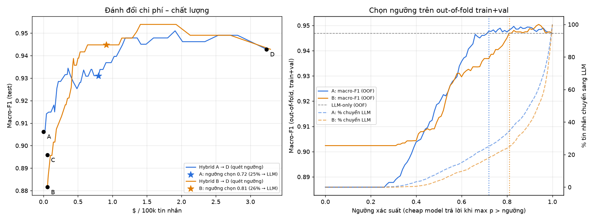

# Khi nào không cần LLM? Đo thật trên bài toán phân loại ý định

> TL;DR — Trên 2.000 tin nhắn hỗ trợ khách hàng tiếng Việt, LLM zero-shot (`gpt-4o-mini`) đạt macro-F1 **0,943**; TF-IDF + logistic regression đạt **0,906** với chi phí **bằng 0** và latency **dưới 1 ms**. Cho model rẻ trả lời khi tự tin, chỉ chuyển **~25%** tin nhắn khó sang LLM, giúp **giảm 72–75% chi phí** mà chất lượng gần như ngang LLM.

## Bài toán

Một sản phẩm SaaS nhận tin nhắn hỗ trợ và cần route vào 5 hàng đợi: `pricing` (hỏi giá), `complaint` (khiếu nại), `cancellation` (hủy gói), `tech_support` (hỗ trợ kỹ thuật), `other` (khác). Tin nhắn thật thì lộn xộn: không dấu ("cho minh huy goi voi"), teencode ("gói pro bn tiền v"), Vietglish, và rất nhiều câu nằm giữa hai ý định ("Dịch vụ tệ quá, hủy luôn cho tôi").

Câu hỏi: có cần gọi LLM cho **mỗi** tin nhắn không?

## Dữ liệu: 2.000 tin, 300 gán nhãn tay

- 300 tin seed gán nhãn tay theo [hướng dẫn gán nhãn](../data/LABELING_GUIDE.md), có quy tắc phân xử cho các ca mập mờ.
- 1.700 tin sinh bằng `gpt-4o-mini` (10 văn phong, 11 persona, ~20% ca khó), gán nhãn độc lập bằng `gpt-4o`.
- **Nhãn LLM có tin được không?** Trên 300 tin seed, annotator `gpt-4o` khớp với người **99,0%** (Cohen's κ = 0,987). Review 100 tin LLM-gán-nhãn ngẫu nhiên thì đồng thuận **95%**, cả hai đều vượt ngưỡng 90%. 5 nhãn sai đã được sửa trong dataset.
- `cancellation` là lớp hiếm (209 tin, ~10%): chia stratified 70/15/15 và dùng class weight cân bằng.

## Kết quả

Test set có 300 tin. Latency đo cho từng tin nhắn một, như một router online thật. Chi phí tính từ số token thực tế nhân giá niêm yết.

| Cách | Macro-F1 test (95% CI) | Macro-F1 CV 5-fold | p95 (ms) | $/100k tin |
|---|---|---|---|---|
| A. TF-IDF + logistic regression | 0,906 (0,87–0,94) | 0,886 ± 0,011 | **0,7** | **~0** |
| B. Embedding + logistic regression | 0,882 (0,84–0,92) | **0,902** ± 0,016 | 318 | 0,06 |
| C. Embedding + XGBoost | 0,896 (0,86–0,93) | 0,879 ± 0,020 | 318 | 0,06 |
| D. LLM zero-shot (`gpt-4o-mini`) | **0,943** (0,92–0,97) | — | 911 | 3,23 |

Ba điều đáng chú ý:

1. **Khoảng cách giữa các model rẻ nhỏ hơn nhiễu.** Trên test, A đứng đầu nhóm rẻ; trên CV 5-fold, B đứng đầu. Khoảng tin cậy chồng lên nhau, vậy nên đừng chọn model dựa trên một lần split.
2. **XGBoost không giúp gì trên embedding.** Với vector dày 1.536 chiều và 1.400 mẫu train, một mô hình tuyến tính là đủ. Cây quyết định hợp với feature dạng bảng hơn.
3. **TF-IDF với char n-gram rất mạnh với tiếng Việt không dấu.** "huy goi", "hủy gói" và "huỷ gói" có chung n-gram ký tự, trong khi embedding API không có lợi thế rõ rệt ở đây.

LLM thắng khoảng 4 điểm macro-F1, nhưng **chậm hơn khoảng 1.000 lần** so với A và **đắt hơn khoảng 50 lần** so với B.

## Model hay nhầm ở đâu?

| Cặp nhầm (thật → đoán) | A | B | C | D |
|---|---|---|---|---|
| other → tech_support | 7 | 6 | 5 | 4 |
| tech_support → other | 5 | 5 | 3 | 1 |
| pricing → other | 2 | 5 | 3 | 2 |
| tech_support → complaint | 3 | 3 | 3 | 2 |
| cancellation → complaint | 2 | 3 | 0 | 1 |
| complaint → pricing | 1 | 2 | 0 | 3 |

- **`other` ↔ `tech_support`** đứng đầu ở **mọi** cách, kể cả LLM. "Có tính năng nào đổi mã dự án không?" là hỏi tính năng (`other`) hay hỏi cách dùng (`tech_support`)? Đây là lỗi **định nghĩa nhãn** chứ không phải lỗi model. Muốn cải thiện thì sửa guideline trước, rồi mới tính đến đổi model.
- **`tech_support` → `complaint`**: "Mỗi lần dùng là có lỗi, không thể nào yên tâm làm việc!" Câu này vừa báo lỗi vừa bực bội, ranh giới phụ thuộc vào giọng điệu.
- **`cancellation` → `complaint`**: "Hơi thất vọng, thôi hủy luôn cho đơn giản". Phần cảm xúc tiêu cực lấn át ý định hủy. Đây là lỗi **đắt nhất** trong thực tế: khách muốn hủy lại bị đẩy vào hàng đợi khiếu nại.
- **LLM cũng có điểm mù riêng**: "Tại sao tháng này bị trừ tiền nhiều hơn tháng trước?" bị LLM đoán là `pricing` vì thấy chủ đề tiền, trong khi theo quy tắc, bị tính sai là `complaint`. Model rẻ học được quy tắc này từ dữ liệu, còn LLM zero-shot thì không.

Trong 29 tin A đoán sai, LLM đúng 24 tin. Ngược lại, trong 17 tin LLM sai, A đúng 12 tin. Hai bên **sai ở những chỗ khác nhau**, và chính điều này khiến chiến lược kết hợp hiệu quả.

## Chiến lược kết hợp: rẻ khi chắc, đắt khi khó

```
p = cheap_model.predict_proba(text)
if p.max() > threshold:  return argmax(p)      # local, ~0,6 ms, $0
else:                    return llm(text)      # ~750 ms, $3,23 / 100k
```

**Chọn ngưỡng mà không nhìn test.** Tập val chỉ có 300 tin, quá nhiễu: ở lần thử đầu, ngưỡng chọn trên val cho F1 0,94 nhưng xuống còn 0,91 khi chạy trên test. Vì vậy tôi dùng dự đoán *out-of-fold* của CV 5-fold trên train+val (1.700 tin), quét ngưỡng từ 0 đến 1, và chọn **ngưỡng rẻ nhất mà macro-F1 không thấp hơn LLM-only** trên cùng dữ liệu. Lý do: mục tiêu là giữ chất lượng LLM với chi phí thấp nhất, không phải tối ưu F1 bằng mọi giá.



| Hybrid | Ngưỡng | % chuyển LLM | Macro-F1 test | p50 (ms) | $/100k | So với LLM-only |
|---|---|---|---|---|---|---|
| A → D | 0,72 | 24,7% | 0,931 | **0,6** | **0,80** | −75% chi phí, −1,2 điểm F1 |
| A → D | 0,80 | 32,7% | 0,940 | 0,6 | 1,06 | −67% chi phí, −0,3 điểm |
| B → D | 0,81 | 26,3% | **0,945** | 274 | 0,91 | −72% chi phí, **ngang F1** |
| D (LLM-only) | — | 100% | 0,943 | 737 | 3,23 | — |

Đường cong ở biểu đồ trái có một điểm thú vị: trong một khoảng ngưỡng, hybrid còn **tốt hơn** LLM-only, vì ở những tin model rẻ rất tự tin, nó đúng hơn LLM (ví dụ ca `complaint → pricing` ở trên).

## Vậy khi nào không cần LLM?

1. **Khi ý định có tín hiệu từ khóa rõ** ("giá", "hủy", "lỗi 500", "seat"): khoảng 75% lưu lượng rơi vào nhóm này, và một mô hình tuyến tính trên TF-IDF xử lý chúng dưới 1 ms.
2. **Khi latency quan trọng**: p50 của router A → D là 0,6 ms, vì 3/4 số tin không chạm vào mạng.
3. **Khi lưu lượng lớn**: với 10 triệu tin/tháng, LLM-only tốn khoảng $323, còn A → D tốn khoảng $80. Số tiền tuyệt đối còn nhỏ với `gpt-4o-mini`, nhưng khoảng cách sẽ nhân lên nhiều lần nếu dùng model lớn hơn hoặc prompt dài hơn (few-shot, có context).
4. **Khi lỗi đến từ nhãn chứ không phải từ model**: cặp `other ↔ tech_support` làm khó mọi model. Đổi sang LLM không sửa được định nghĩa mập mờ.

**Vẫn cần LLM** cho khoảng 25% tin nhắn còn lại: câu dài, nhiều ý, cảm xúc lẫn yêu cầu, hoặc diễn đạt chưa từng thấy trong tập train.

## Giới hạn

- 85% nhãn đến từ LLM (dù đã kiểm tra với 99% / 95% đồng thuận), và annotator `gpt-4o` cùng họ với model D. Điều này có thể **thiên vị D**. Trên tập con chỉ gồm tin người gán nhãn trong test (37 tin), D đạt 0,973, còn A đạt 0,905. Xu hướng vẫn giữ nguyên, nhưng mẫu quá nhỏ để kết luận chắc chắn.
- Tin nhắn sinh tổng hợp "sạch" hơn tin nhắn thật. Trước khi dùng trong production, cần đánh giá lại trên log thật.
- Latency của embedding API và LLM được đo từ một máy, vào một thời điểm cụ thể. Con số tuyệt đối sẽ thay đổi theo mạng và tải, nhưng chênh lệch tương đối giữa các cách thì đáng tin hơn.

Code, dữ liệu và notebook chạy lại được (không cần API key): [README](../README.md).
